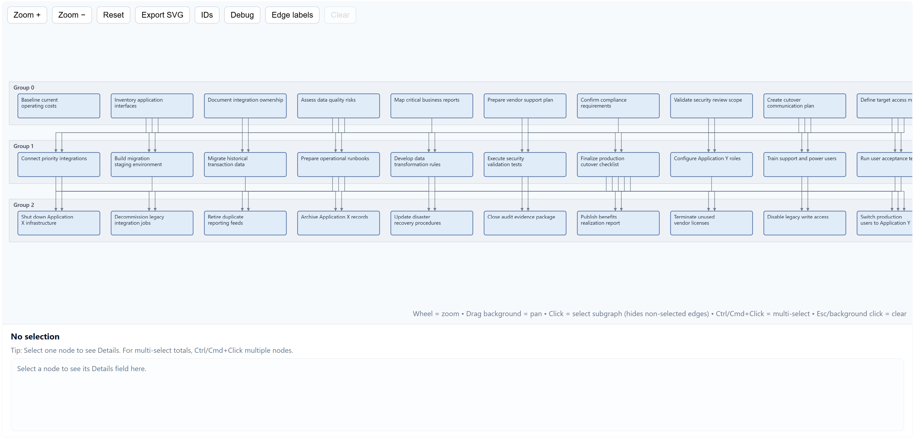
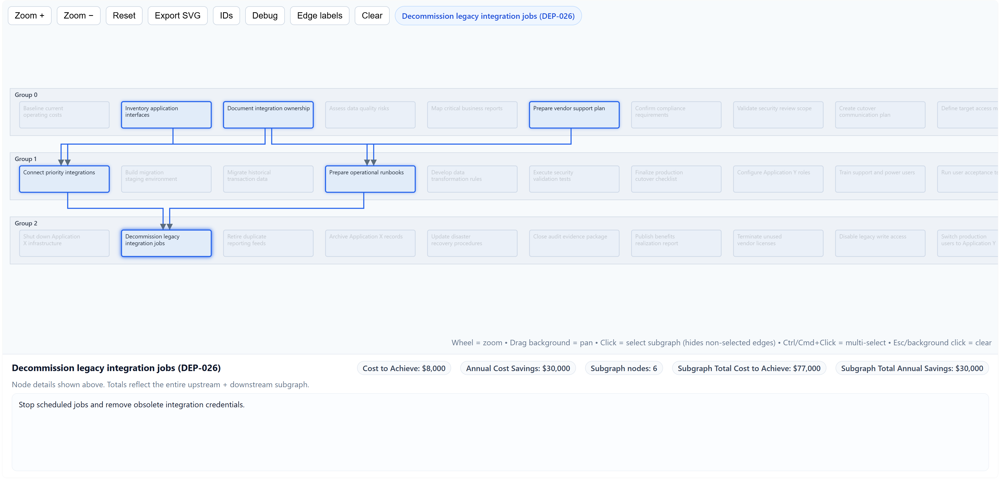

# HTML5 SVG Dependency Roadmap Viewer

An interactive HTML/SVG viewer for dependency roadmaps stored in Excel.

## Preview




The project takes a spreadsheet of activities and dependencies, generates `data.json`, and renders the result in `viewer.html` as grouped dependency rows. It is useful for application migrations, decommission plans, delivery roadmaps, and any workflow where activities depend on prior activities.

## Features

- Reads roadmap data from `Roadmap.xlsx`
- Generates browser-friendly `data.json`
- Renders activities as SVG nodes grouped by dependency depth
- Draws dependency arrows between activities
- Supports clickable node selection
- Highlights upstream and downstream subgraphs
- Shows activity details, cost to achieve, and annual savings
- Supports optional multi-select with `Ctrl`/`Cmd` click
- Exports the current SVG view
- Splits long activity labels into two node rows automatically

## Repository Contents

| File | Purpose |
| --- | --- |
| `Roadmap.xlsx` | Source spreadsheet for activities and dependencies |
| `gen_datajson.py` | Small command-line generator for `data.json` |
| `excel2svg.py` | Spreadsheet reader, dependency grouping, and JSON writer |
| `data.json` | Generated viewer data consumed by `viewer.html` |
| `viewer.html` | Interactive browser-based SVG viewer |
| `elk.bundled.js` | Bundled ELK layout dependency used by the viewer |
| `run.cmd` | Windows helper that regenerates data and opens the viewer |

## Quick Start

On Windows, run:

```cmd
run.cmd
```

This will:

1. Read `Roadmap.xlsx`
2. Generate `data.json`
3. Start a local web server on port `8000`
4. Open `http://localhost:8000/viewer.html`

## Manual Usage

Install Python dependencies:

```bash
python -m pip install pandas openpyxl
```

Generate `data.json`:

```bash
python gen_datajson.py Roadmap.xlsx --sheet Sheet1 -o data.json
```

Start a local web server:

```bash
python -m http.server 8000
```

Open:

```text
http://localhost:8000/viewer.html
```

Using a local server is recommended because browsers often block `fetch('data.json')` when opening `viewer.html` directly from the filesystem.

## Spreadsheet Format

The spreadsheet must include these columns:

| Column | Description |
| --- | --- |
| `Dep ID` | Unique activity ID, for example `DEP-001` |
| `Activity Name` | Text shown in the roadmap node |
| `Dependency 1` | First prerequisite activity ID |
| `Dependency 2` | Second prerequisite activity ID |
| `Dependency 3` | Third prerequisite activity ID |
| `Dependency 4` | Fourth prerequisite activity ID |
| `Dependency 5` | Fifth prerequisite activity ID |

Optional columns:

| Column | Description |
| --- | --- |
| `Details` | Longer description shown in the details panel |
| `Cost to Achieve` | One-time cost displayed in node details and totals |
| `Cost Savings` | Annual savings displayed in node details and totals |

Rows with an `Action` column value of `ignore` are skipped if that column exists.

## How Dependencies Work

Dependencies point from prerequisite to dependent activity.

For example, if `DEP-011` depends on `DEP-001`, then the `DEP-011` row should include `DEP-001` in one of the dependency columns.

The generator calculates groups automatically:

- Activities with no dependencies appear in `Group 0`
- Activities depending only on `Group 0` activities appear in `Group 1`
- Activities depending on `Group 1` activities appear in `Group 2`
- And so on

## Multiline Activity Labels

Long activity names are automatically split when generating `data.json`.

By default, names longer than 30 characters are split near the middle at a word boundary. The viewer renders the split labels as two SVG rows.

You can also manually include line breaks in `data.json` labels using:

```json
"Activity line one\\nActivity line two"
```

The viewer will show this as two rows inside the node, while the toolbar and details panel collapse the line break into a normal space.

## Costs And Savings

`Cost to Achieve` and `Cost Savings` can be entered as numbers or simple currency values, such as:

```text
12000
$12,000
(12000)
```

Blank or non-numeric values are treated as `0`.

When a node is selected, the details panel shows:

- The selected activity's cost and savings
- The total cost and savings across the selected upstream and downstream subgraph

## Interaction

In the viewer:

- Mouse wheel zooms
- Drag the background to pan
- Click a node to select its dependency subgraph
- `Ctrl`/`Cmd` click adds or removes nodes from the selection
- Click the background or press `Esc` to clear selection
- Toggle `IDs` to show node IDs
- Toggle `Edge labels` to show source-target edge IDs
- Use `Export SVG` to save the current SVG

## Regenerating Data

After editing `Roadmap.xlsx`, regenerate `data.json`:

```bash
python gen_datajson.py Roadmap.xlsx --sheet Sheet1 -o data.json
```

Refresh the browser to see the updated roadmap.

## Third-Party Licenses

This project bundles `elk.bundled.js` from ELK.js / Eclipse Layout Kernel. See the upstream ELK.js license for details.

## Notes

- Keep `Dep ID` values unique.
- Dependency values must match existing `Dep ID` values.
- Missing dependency IDs are added as external placeholder nodes.
- Cycles are detected and placed into a final group.
- `data.json` is generated output, but it can be committed if you want GitHub users to open the included sample immediately.
